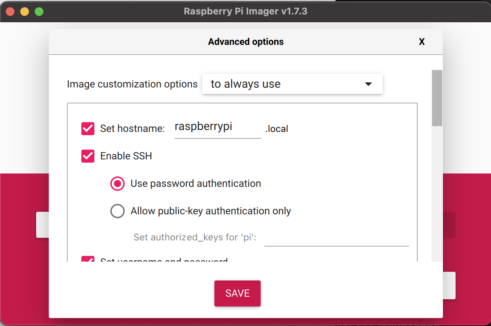

# LaserPi

This project draws light art on glow-in-the-dark targets using a laser pointer and a Raspberry Pi. This repo is a fork of `tuckershannon/LaserPi`, and he deserves the props for the cool factor. 

<br>

## Requirements
To run this project, you'll need ... 
- a Raspberry Pi computer (I used a [RPi 3B+](https://www.raspberrypi.com/products/raspberry-pi-3-model-b/))
- Adafruit [pre-built servo gimbals](https://adafru.it/1967)

<br>

## Setup (Mac)


1. **Image a fresh Raspberry Pi**. Use [Raspberry Pi Imager](https://www.raspberrypi.com/software/) to set up a fresh SD card. Use the ⚙️ gear icon in the lower-right corner to add ... 
    - `hostname` of `raspberrypi.local`
    - ✅ enable `ssh` 
    - `username` / `password` to something non-default, [to avoid hackers](https://www.raspberrypi.com/news/raspberry-pi-bullseye-update-april-2022/)
    - ✅ `Configure wireless LAN` with valid WiFi creds



2. **Connect Pi to Wi-Fi.** Put the SD card you just made into the Raspberry Pi, and boot it. After 1-2 mins, it should connect to Wi-Fi using the creds you entered in step (1). You can use a computer on your local network to `ping` the Pi and verify it's awake ... 

```sh
% ping raspberrypi.local
PING raspberrypi.local (192.168.86.26): 56 data bytes
64 bytes from 192.168.86.26: icmp_seq=0 ttl=64 time=170.196 ms
64 bytes from 192.168.86.26: icmp_seq=1 ttl=64 time=10.037 ms
...
```

3. **SSH into your new Raspberry Pi.** Now that your Raspberry Pi is awake, you should be able to login remotely using SSH over WiFi. From a local computer, run ... 

```sh
ssh pi@raspberrypi.local
```
... and use the `password` you set up in step (1) to complete the authorization. If you have a Windows machine, see the [RPi docs on how to emulate `ssh` using `PuTTY`](https://learn.sparkfun.com/tutorials/headless-raspberry-pi-setup/wifi-with-dhcp).

4. **Run the setup script.** Your new Raspberry Pi is missing some of the libraries we'll need, like `git`. To setup up everything we need, run `rPiFirstBootSetup.sh` on your RPi. Starting on the local computer, 

```sh
cd PATH/TO/LASERPI/REPO # <= replace w the path to LaserPi repo
ssh pi@raspberrypi.local 'bash -s' < rPiFirstBootSetup.sh
```

When setup is complete, you'll see ... 

```
 finished Pi setup, rebooting ...
```

<br>


## Run
Congrats! Now you have a fresh Raspberry Pi with a `master` copy of `LaserPi`. So you can run any of the python scripts in `LaserPi/`, like `servoTest.py`. If you've wired your circuit correctly, your Adafruit servos should start to wiggle.

### Prototyping from 💻 a local Mac
From a computer on your local network ... 

1. Make change 
2. Push up to `master`
3. Run test script ... 

```sh
ssh pi@raspberrypi.local 'bash -s' < rPiLocalTest.sh
```

### Prototyping from 🍇 your Raspberry Pi
If you're already on your RPi, you can just run ... 

```sh
LaserPi/rPiLocalTest.sh
```